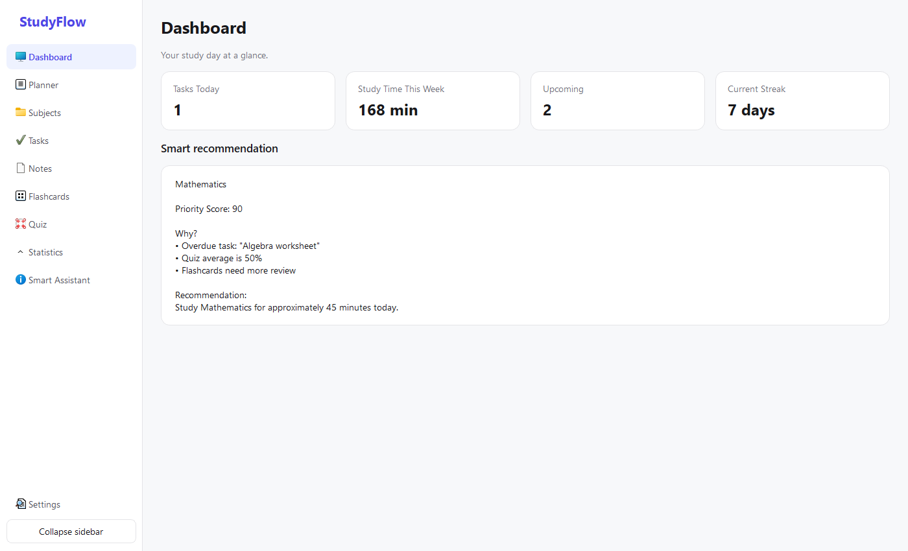

# StudyFlow

StudyFlow is an offline personal study assistant for students and a capstone project for a Python Master course. It is a real PySide6 desktop application: every visible feature reads or changes local data, and no account, database, Internet connection, API key, generative AI, or external service is required.

## Features

- First-launch onboarding for the student's name and default study duration.
- Dashboard with live task, study-time, deadline, streak, and recommendation data.
- Subject create, edit, delete, and case-insensitive search with relationship protection.
- Task create, edit, start, complete, delete, search, status filter, deadline sorting, priorities, and validation.
- Planner with linked tasks, planned/actual time, session completion, and a live study timer.
- Plain-text notes that safely preserve UTF-8 Vietnamese, commas, quotation marks, and new lines.
- Flashcard creation and priority review using Again / Hard / Good / Easy results.
- User-created four-option quizzes, quiz attempts, scoring, explanations, answer review, and stored results.
- Statistics cards and Matplotlib charts for study time, quiz scores, flashcard accuracy, subject totals, and streaks.
- Smart Assistant recommendations and time-bounded study plans based on deterministic local rules.
- Settings for profile, data counts, demo data, reload, reset, opening the data folder, and CSV export.
- Friendly empty states, validation messages, confirmations, logs, and safe handling for missing or malformed files.

## Screenshots

The screenshot below is rendered from the real application with runtime-generated demo data. The default window is 1400 × 850 and supports a minimum size of 1100 × 700.



## Tech Stack

- Python 3.11+
- PySide6
- Python standard-library `csv`, `datetime`, `logging`, and file APIs
- Matplotlib
- Pytest

## Project Structure

```text
StudyFlow/
├── main.py
├── requirements.txt
├── README.md
├── app/
│   ├── data/             # deterministic demo-data generator
│   ├── models/           # domain objects and serialization
│   ├── repositories/     # model ↔ CSV dictionary conversion
│   ├── services/         # validation, CRUD rules, statistics, recommendations
│   ├── storage/          # CSV schemas and safe raw file operations
│   ├── theme/            # centralized colors and QSS
│   ├── ui/               # main window, pages, dialogs, widgets
│   └── utils/            # dates, validation, ID and conversion helpers
├── data/                 # runtime CSV files; ignored by Git
├── exports/              # user-created exports; ignored by Git
├── logs/                 # application logs; ignored by Git
└── tests/                # storage, service, statistics, assistant, GUI smoke tests
```

The main dependency direction is:

```text
PySide6 UI
    ↓
Services
    ↓
Repositories
    ↓
Models and dictionaries
    ↓
CSVStorage
    ↓
CSV files
```

The UI never opens a CSV file directly.

## How Data Is Stored

StudyFlow does not use a database. Data is stored locally in UTF-8 CSV files under `data/`. Each file is created automatically with the correct header if it is missing or empty.

```text
User creates a task
    ↓
Python creates a Task object
    ↓
Task.to_dict()
    ↓
Task repository
    ↓
CSVStorage
    ↓
tasks.csv
```

At startup the flow is reversed:

```text
tasks.csv → DictReader → dictionaries → Task.from_dict() → service → UI
```

`CSVStorage` uses `csv.DictReader` and `csv.DictWriter` with `QUOTE_ALL`, `encoding="utf-8"`, and `newline=""`. Updates and deletes first write a temporary file and only then use `os.replace()` to replace the original. This reduces the chance of losing the original data during a failed rewrite.

### CSV files and fields

| File | Fields |
|---|---|
| `profile.csv` | name, created_at |
| `subjects.csv` | id, name, color, description, target_score, created_at |
| `tasks.csv` | id, title, description, subject_id, deadline, priority, estimated_minutes, status, created_at, completed_at |
| `study_sessions.csv` | id, subject_id, task_id, date, start_time, planned_minutes, actual_minutes, note, status, created_at |
| `notes.csv` | id, title, subject_id, content, created_at, updated_at |
| `flashcards.csv` | id, subject_id, question, answer, difficulty, correct_count, wrong_count, last_reviewed, created_at |
| `quizzes.csv` | id, subject_id, title, description, created_at |
| `quiz_questions.csv` | id, quiz_id, question_text, option_a, option_b, option_c, option_d, correct_option, explanation |
| `quiz_results.csv` | id, quiz_id, score, total, accuracy, duration_seconds, completed_at |
| `settings.csv` | key, value |

IDs use `max(existing valid IDs) + 1`; deleting a record never renumbers other records. Dates are stored as `YYYY-MM-DD` and displayed as `DD/MM/YYYY`.

## Smart Assistant Logic

StudyFlow does not use generative AI. The Smart Assistant uses deterministic rules and locally stored study data to generate recommendations.

```text
CSV data → statistics → rules → priority score → response template
```

Scores increase for overdue tasks, tasks due today or tomorrow, high priority, quiz averages below 70%, flashcards with low accuracy or old reviews, and less than 30 minutes of recent subject activity. The visible explanation lists the real triggers. A study plan ranks subjects by score, divides the available time proportionally into practical sessions, and never allocates more than the entered time.

## Installation on Windows

Check Python:

```powershell
python --version
```

Create and activate a virtual environment:

```powershell
python -m venv .venv
.venv\Scripts\activate
```

Install only the declared dependencies:

```powershell
pip install -r requirements.txt
```

## Run

```powershell
python main.py
```

On the first launch, enter a name and a default study duration. To explore every page immediately, open Settings and choose **Load Demo Data**.

## Testing

Run all automated tests:

```powershell
pytest
```

The suite covers missing-file creation, headers, append/read/update/delete, atomic rewrites, UTF-8, commas, quotes, multiline notes, malformed rows, task validation, subject relationships, quizzes, statistics, recommendation priorities, bounded study plans, demo data, application-window creation, navigation, and minimum-size layout smoke testing.

For a manual persistence exercise:

1. Create a subject and task.
2. Inspect `data/subjects.csv` and `data/tasks.csv`.
3. Close and reopen StudyFlow; confirm the task remains.
4. Edit, complete, and delete it; inspect the CSV after each action.
5. Add a Vietnamese note containing commas, quotes, and multiple lines.
6. Restart and confirm the note is unchanged.

## Demo Data

Demo data is generated at runtime by `app/data/seed.py`; demo CSV files are not committed. It creates Minh's profile, four subjects, eight tasks, seven sessions, ten flashcards, five multiline notes, three quizzes, twelve questions, and three results. Loading demo data replaces current learning records after confirmation.

## Export

Settings can export Tasks, Study History, and Quiz Results. Exports are timestamped CSV snapshots under `exports/`; primary storage always remains under `data/`.

## Git Instructions

Runtime CSVs, logs, exports, caches, editor settings, virtual environments, and build output are ignored. The `.gitkeep` files preserve empty runtime folders without committing personal student data.

```powershell
git init
git add .
git commit -m "Initial StudyFlow project"
git branch -M main
git remote add origin <PRIVATE_REPOSITORY_URL>
git push -u origin main
```

Create the GitHub repository with **Private** visibility. Never commit a populated `data/*.csv` file.

## Troubleshooting

- **`ModuleNotFoundError: PySide6`** — activate the virtual environment and run `pip install -r requirements.txt`.
- **Application cannot write data** — close any program holding a CSV file open and check write permission for the project folder.
- **A manually edited row does not appear** — confirm the header and value formats, then use Settings → Reload Data. Invalid model rows are skipped and noted in `logs/studyflow.log`.
- **Charts have no bars or lines** — complete study sessions or load demo data; empty statistics are shown safely.
- **A subject cannot be deleted** — first delete its linked tasks, sessions, notes, flashcards, and quizzes to preserve references.
- **Reset was selected** — reset permanently clears local CSV rows and recreates headers; it does not delete source code, the seed generator, logs, or exported snapshots.

## Known Limitations

- StudyFlow is a single-user local application with no synchronization or account system.
- The quiz creation dialog intentionally creates one fully functional question per quiz to keep the classroom flow simple; multiple quizzes can be created, and the storage/service layer supports multiple questions per quiz.
- Flashcard review uses transparent priority scoring rather than a full spaced-repetition algorithm.
- The timer runs while StudyFlow remains open; it is not an operating-system background timer.
- Light mode is the only exposed theme because an incomplete theme is not presented as a feature.

## Quick Start

1. Clone the private repository.
2. Create and activate `.venv`.
3. Install `requirements.txt`.
4. Run `python main.py`.
5. Complete onboarding or load demo data.
6. Run `pytest` before making a release or teaching copy.
