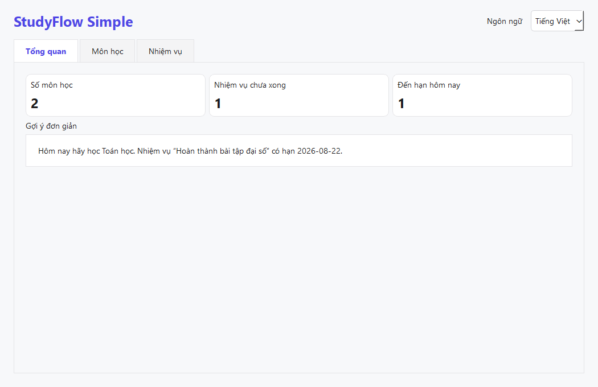

# StudyFlow Simple — Phiên bản giảng dạy

Đây là phiên bản tối giản của StudyFlow dành cho học sinh mới học Python. App vẫn chạy thật, lưu CSV thật và có giao diện PySide6 thật, nhưng chỉ giữ các phần cốt lõi để mỗi dòng code đều có thể giải thích trong lớp.

## Chạy app

Từ thư mục gốc của dự án:

```powershell
python -m teaching.main
```

Trên Windows có thể nhấp đúp `run_teaching.bat`.



## Chỉ có 4 file Python

```text
teaching/
├── __init__.py       # Đánh dấu package
├── csv_helper.py     # 4 hàm đọc/ghi CSV + tạo ID
├── translations.py   # Chữ Anh/Việt và thư viện môn học
└── main.py           # Một lớp cửa sổ, ba trang chức năng
```

CSV được tạo tự động trong `teaching/data/` khi app chạy. Các file dữ liệu cá nhân không được đưa lên GitHub.

## App có gì?

- Chuyển đổi English / Tiếng Việt và ghi nhớ lựa chọn.
- Tổng quan: số môn, nhiệm vụ chưa xong, nhiệm vụ đến hạn hôm nay.
- Thư viện môn học song ngữ và môn tự thêm có hai tên Anh/Việt.
- Thêm và xóa môn; không cho xóa môn đang được nhiệm vụ sử dụng.
- Thêm, hoàn thành và xóa nhiệm vụ.
- Gợi ý môn cần học dựa trên nhiệm vụ chưa xong có hạn gần nhất.
- Dữ liệu vẫn còn sau khi đóng và mở lại app.

## Vì sao bản này dễ học hơn?

| Bản Simple | Bản đầy đủ |
|---|---|
| 4 file Python | Nhiều package theo kiến trúc chuyên nghiệp |
| Dữ liệu là `dict` | Dữ liệu là dataclass/model |
| Hàm CSV trực tiếp | Storage + repository + service |
| Một lớp cửa sổ | Nhiều page, dialog, widget và service |
| 3 trang cốt lõi | 10 trang đầy đủ |
| Gợi ý bằng một quy tắc | Hệ thống chấm điểm nhiều quy tắc |

Bản Simple phù hợp để học và tự viết lại. Bản đầy đủ phù hợp để đọc sau khi học sinh đã hiểu module, class, CRUD, quan hệ dữ liệu và testing.

## Thứ tự đọc code

1. `translations.py`: đọc dictionary và hàm tìm kiếm đơn giản.
2. `csv_helper.py`: hiểu object/dictionary đi vào CSV như thế nào.
3. Đầu file `main.py`: đường dẫn, field CSV và stylesheet.
4. `build_ui()` và ba hàm `make_*_page()`.
5. `add_subject()`, `add_task()`, `complete_task()`, `delete_task()`.
6. `refresh_all()` để thấy dữ liệu CSV được đưa lại lên UI.
7. `make_recommendation()` để hiểu quy tắc gợi ý.

## Quy tắc học

- Không yêu cầu học sinh chép toàn bộ `main.py` trong một buổi.
- Mỗi tuần chỉ xây một lát cắt nhỏ chạy được.
- Sau mỗi chức năng: chạy app, thao tác thật, mở CSV để đối chiếu, rồi mới viết test.
- Học sinh phải giải thích được dữ liệu đi theo luồng `UI → dictionary → CSV → dictionary → UI`.
- Không dùng pandas, database, API hay AI để che logic Python cơ bản.

Giáo trình đầy đủ nằm tại `GIAO_TRINH_STUDYFLOW_SIMPLE.md` ở thư mục gốc.
